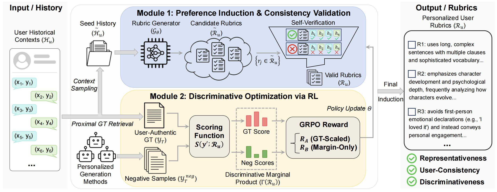

<div align=center>
<h1>Preference-Aware Rubric Learning for Personalized Evaluation</h1>
</div >

This is the implementation of the **PARL** (**P**reference-**A**ware **R**ubric **L**earning) framework proposed in our paper.



------

In our experiments, we employ three personalized text generation tasks: *Amazon Review*, *Reddit Post*, and *News Headline*.

We have two implementation variants: **PARL-A** and **PARL-B**.

We use the *Amazon Review* task and **PARL-A** as illustrative examples. Other tasks and variants follow the same paradigm.

## Quick Start

We provide an installation script for a quick start. Please also specify the API URL and key for the evaluator model `Qwen/Qwen3-235B-A22B-Instruct-2507`.

```python
export RUBRICS_BASE_URL=
export RUBRICS_API_KEY=

conda create -n parl python=3.11 -y
conda activate parl
bash install.sh
```

## Data Processing

Before conducting experiments, please put datasets in folder `recipe/parl/datasets`.

## Training

To train the rubric generator, simply run the following scripts:

```python
bash recipe/parl/scripts/amazon/run_parl_a.sh
```

## Rubric Generation

After training, please first merge the model weights for serving:

```python
bash recipe/parl/scripts/amazon/merge.sh
```

Next, please deploy the server in local environment (or remote if possible):

```
bash recipe/parl/scripts/amazon/server-a.sh
```

In another terminal, please run the following commands to generate rubrics for the corresponding task:

```python
cd recipe/parl/scripts/amazon/
python generate-rubrics-a.py
```

## Benchmarking

To conduct experiments on induced rubrics, please simply run:

```python
python eval-test.py --data_dir amazon_parl_a
```

------

## Acknowledgements

Our implementation is based on [verl](https://github.com/volcengine/verl) and [vLLM](https://github.com/vllm-project/vllm).
